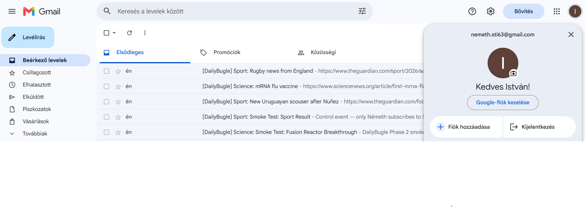
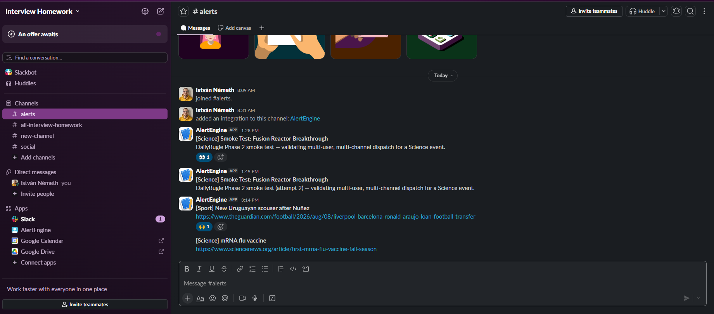

# Phase 3 — Frontend Manual Test Report (Round 2)

> Companion docs: [PLAN.md](../PLAN.md) · [ARCHITECTURE.md](../ARCHITECTURE.md) ·
> [DECISION_LOG.md](../DECISION_LOG.md) · [FUTURE_IMPROVEMENTS.md](../FUTURE_IMPROVEMENTS.md) ·
> [Round 1 (automated smoke test)](./phase3-frontend-smoke-test-round1.md)

**Purpose:** Human manual test pass of the WPF app following Round 1's automated smoke test, run by
the user in a single continuous app session. This round exercises the end-to-end paths that Round 1
explicitly deferred: adding a rule, firing real events end-to-end (real Slack/Gmail delivery), and
narrowing a user's subscriptions.

**Date/time:** 2026-08-08, manual session, single app instance.

**Harness:** Real running `DailyBugle.Wpf` app (no mocks), real seeded demo users (Estebán Alemán,
Németh István), real Slack webhook and Gmail SMTP delivery. Test cases were executed **sequentially
in one app session** — each case's starting state is the previous case's ending state (not
independent/isolated cases).

## Test cases

| # | Case | Result |
|---|------|--------|
| TC1 | Add a new subscription for Estebán Alemán: **Sport** news type | ✅ Pass — rule added successfully |
| TC2 | Fire **Sport** news from Admin tab ("Araujo to Liverpool") | ✅ Pass — both users received the notification |
| TC3 | Fire **Science** news from Admin tab ("mRNA flu vaccine") | ✅ Pass — both users received the notification |
| TC4 | Remove all of Estebán's rules except Science, then fire a **Sport** news item ("Rugby news from England") from Admin tab | ✅ Pass — only Németh István received it (Estebán correctly excluded, since his only remaining rule is Science) |

**Evidence (captured at the end of the session, reflecting the cumulative state after TC1–TC4):**

**Overall verdict: partially passed.** All 4 functional test cases passed — the core acceptance
criterion from `PLAN.md` §6 ("User tab can list and add rules... Admin tab can fire an event...UI
reflects changes without restart") is confirmed working end-to-end with real delivery channels.
However, 3 issues were found during the session (below), so this round is **not** a clean pass.

## Findings

### Finding 1 — Application startup is slow

**Symptom:** the WPF app takes a noticeably long time to go from launch to a responsive main
window.

**Investigation:** searched the entire `src/` tree for artificial waits (`Task.Delay`,
`Thread.Sleep`, fixed timeouts) that could be blocking startup. Result: **no such wait exists on the
WPF app's startup path.** The only `Task.Delay` calls in the whole solution are in the unrelated
`DailyBugle.SmokeTest` console harness (`Program.cs:70,92`, a design-time demo script, never invoked
by the WPF app). `AdminViewModel.FireEventAsync` does have a 20-second **timeout guard**
(`WaitAsync(TimeSpan.FromSeconds(20))`) around waiting for real dispatch delivery to complete, but
that is a safety ceiling for a real async operation (SMTP/Slack HTTP round-trip), not a fixed
sleep — it only elapses fully if delivery genuinely hangs.

**Likely real cause (not yet root-caused precisely, given time-boxed scope):** `App.xaml.cs` eagerly
resolves `AlertDispatcher` at startup (`OnStartup`) specifically so it subscribes to
`NewsSimulator.EventPublished` before the window shows; this in turn eagerly constructs **both**
`INotificationChannel` singletons (`EmailNotificationChannel`, `SlackNotificationChannel`) and the
`NotificationChannelResolver`, plus DPAPI secret decryption (`EncryptedSecretsStore.Load`) and full
DI container build all happen synchronously on the UI thread before `mainWindow.Show()`. None of
these do genuine I/O at construction time today, but combined with normal WPF/JIT cold-start
overhead this is consistent with a slow-but-not-infinite startup, rather than any single "magic
wait."

**Action taken:** none (no code change) — the report's job here is investigation/documentation, no
magic wait was found to remove. Logged as a candidate for future startup-performance profiling; see
recommendation below.

### Finding 2 — "Active" checkbox is not editable

**Symptom (found during TC4, disabling a subscription instead of deleting it):** the User tab's
Alert Rules `DataGrid` shows an "Active" checkbox column, but it cannot be toggled — there is no way
to temporarily deactivate a rule without deleting it outright.

**Root cause:** `Views/UserView.xaml`'s Rules `DataGrid` is declared `IsReadOnly="True"` at the grid
level, which makes every column (including the `DataGridCheckBoxColumn` bound to `IsActive`)
non-interactive. There is also no `[RelayCommand]`/service method wired up today to persist an
`IsActive` toggle back through `AlertRuleService`/`IAlertRuleRepository` even if the grid were made
editable.

**Disposition:** not fixed in this round (functional workaround exists: delete + re-add the rule).
**Logged as `FI-002` in [FUTURE_IMPROVEMENTS.md](../FUTURE_IMPROVEMENTS.md).**

### Finding 3 — Admin tab's "Registered Users" list does not live-update on rule changes

**Symptom (found during TC1 and TC4):** after adding a rule for Estebán (TC1) or removing his rules
down to just Science (TC4) from the User tab, switching back to the Admin tab's "Registered Users"
list still shows his **old** channel/news-type summary — it does not reflect the just-made changes
until... (was never observed to refresh at all during this session; only a full app restart would
reload it).

**Root cause:** `AdminViewModel.RefreshUsers()` (which rebuilds the `Users` list, including each
row's per-user active channels/news types summary) is only ever called once, from the
`AdminViewModel` constructor. `UserViewModel.AddRule`/`RemoveRule` call their own local
`RefreshRules()` (User tab only) but have no reference to `AdminViewModel` and raise no shared event
that it could subscribe to — so nothing ever tells the Admin tab's already-constructed view model
that user rule data changed underneath it.

**Disposition:** not fixed in this round. **Logged as `FI-003` in
[FUTURE_IMPROVEMENTS.md](../FUTURE_IMPROVEMENTS.md).**

## Status

- ✅ TC1–TC4: all 4 functional cases **passed** (rule add/remove, multi-recipient Sport/Science
  dispatch, targeted exclusion after narrowing subscriptions) — real Gmail + Slack delivery
  confirmed via screenshot evidence.
- ⚠️ Finding 1 (slow startup): investigated, no artificial wait found; flagged for future
  performance profiling (see recommendation below).
- ⚠️ Finding 2 (Active checkbox not editable): confirmed root cause, deferred, logged as `FI-002`.
- ⚠️ Finding 3 (Registered Users list not live-updated): confirmed root cause, deferred, logged as
  `FI-003`.
- **Overall Round 2 verdict: partial pass** — core functionality works end-to-end with real
  delivery; three non-blocking rough edges identified and tracked for follow-up, none of which
  affect the correctness of the alert matching/dispatch logic itself.

## Recommendation

Given the 3 findings above are UX/perf polish rather than functional defects, and per `PLAN.md`'s
scope-cut ordering (Phase 5 polish is first to cut, Phase 2/3/4 core functionality is
non-negotiable), recommend closing Phase 3 with these 3 items tracked in `FUTURE_IMPROVEMENTS.md`
rather than spending further Phase 3 budget fixing them now.
