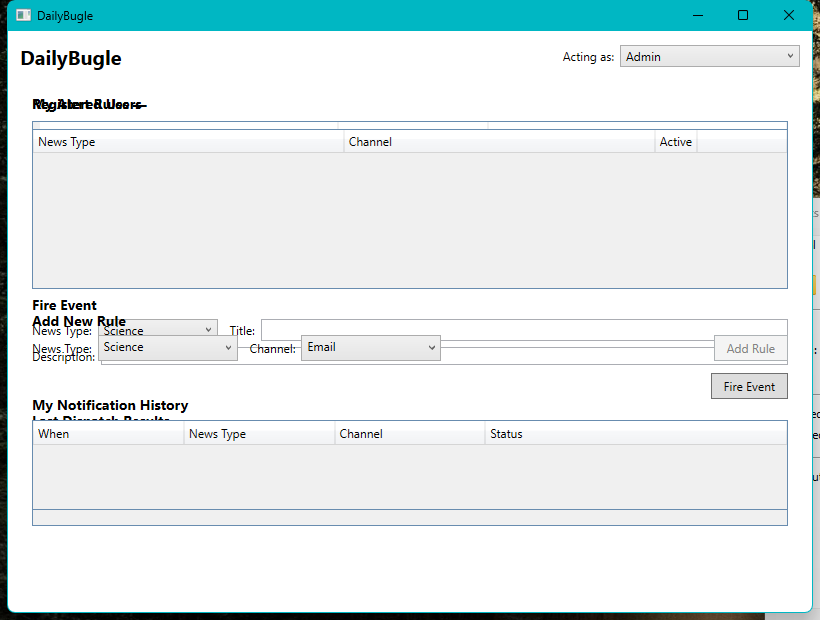
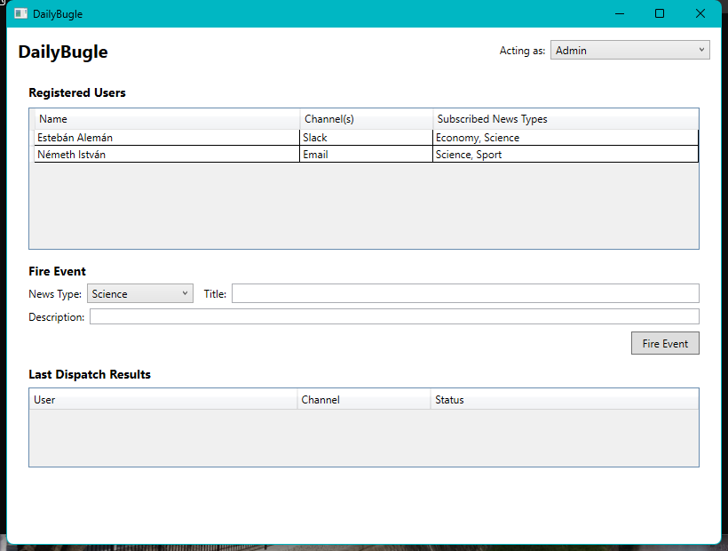
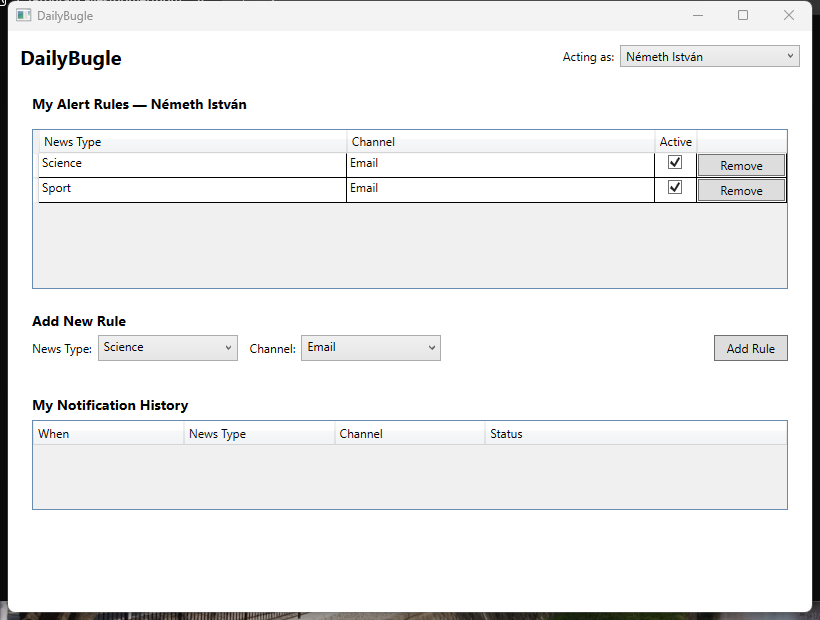

# Phase 3 — Frontend Automated Smoke Test Report (Round 1)

> Companion docs: [PLAN.md](../PLAN.md) · [ARCHITECTURE.md](../ARCHITECTURE.md) ·
> [DECISION_LOG.md](../DECISION_LOG.md)

**Purpose:** Validate Phase 3's acceptance criterion (`PLAN.md` §6): "WPF app launches; Admin tab
can list users and fire an event; User tab can list and add rules; UI reflects changes without
restart." This round covers the **first automated pass** immediately after the initial WPF
implementation, run by the AI agent (build → launch → screenshot → UI Automation) before any human
manual testing.

**Date/time:** 2026-08-08, ~14:40–14:57.

## Harness

- `dotnet build`/`dotnet run --no-build` against the real `DailyBugle.Wpf` project — no mocks, the
  real DI composition root (`App.xaml.cs`), real `secrets.local.json`, real seeded demo users.
- Visual verification via Win32 `GetWindowRect` + `Graphics.CopyFromScreen` screenshots of the live
  window.
- Interaction/state verification via `System.Windows.Automation` (UI Automation): expanding the
  "Acting as" `ComboBox`, selecting an identity, and reading `Button.IsEnabled` for every button in
  the tree.
- **Caveat surfaced during this round:** UI Automation's `Descendants` search returns automation
  peers for elements even while their `Visibility` is `Collapsed` — an early script mistakenly
  grabbed the *first* `ComboBox` found in document order (which was **not** the "Acting as"
  selector) and silently failed to change identity, producing a misleading "still broken" result
  that was corrected by filtering candidate combo boxes by their item contents (see Bug 2 below).
  Screenshots (pixel-level, "what a user actually sees") were the reliable evidence in every case;
  automation-tree queries were double-checked against them before being trusted.

## Bugs found and fixed

### Bug 1 — Admin and User tabs rendered stacked on top of each other

**Symptom (screenshot evidence, reproduced on demand from the pre-fix code):**



Both `AdminView` and `UserView` were simultaneously `Visible`, their content overlapping in the same
`Grid` cell, regardless of the selected "Acting as" identity.

**Root cause:** in `MainWindow.xaml`, `Visibility="{Binding IsAdminModeActive, ...}"` and
`DataContext="{Binding AdminVm}"` / `DataContext="{Binding UserVm}"` were set on the **same**
`views:AdminView`/`views:UserView` element. The `DataContext` override took effect first, so the
`Visibility` binding resolved `IsAdminModeActive` against `AdminViewModel`/`UserViewModel` (neither
of which has that property) instead of `MainViewModel`. The binding failed silently (a WPF binding
error, only visible in Debug output, not surfaced to the user) and `Visibility` fell back to its
default, `Visible`, for both views.

**Fix:** wrap each view in its own `Grid`. `Visibility` is now bound on the wrapping `Grid`, which
still inherits `MainViewModel` as its `DataContext` from the `Window`; the `DataContext` override to
`AdminVm`/`UserVm` is scoped to the inner view element only, no longer shadowing the visibility
binding.

```xml
<Grid Margin="12">
    <Grid Visibility="{Binding IsAdminModeActive, Converter={StaticResource BooleanToVisibilityConverter}}">
        <views:AdminView DataContext="{Binding AdminVm}" />
    </Grid>
    <Grid Visibility="{Binding IsAdminModeActive, Converter={StaticResource InverseBooleanToVisibilityConverter}}">
        <views:UserView DataContext="{Binding UserVm}" />
    </Grid>
</Grid>
```

**Verified fixed (screenshots, single running instance, Admin identity then Németh István):**




### Bug 2 — "Add Rule" button stayed permanently disabled after switching identity

**Symptom:** `UserViewModel.AddRuleCommand`'s `CanExecute` (`CanModifyRules`, gated on
`_currentUserId is not null`) never re-evaluated after `LoadForIdentity` set `_currentUserId` from
`null` (Admin) to a real user's Id — the button stayed grayed out/disabled even after selecting
"Németh István" or "Estebán Alemán".

**Root cause:** CommunityToolkit.Mvvm's `[RelayCommand]`-generated commands do **not**
auto-requery `CanExecute` on arbitrary state changes (unlike WPF's `CommandManager`-driven
`RoutedCommand`) — they only raise `CanExecuteChanged` when `NotifyCanExecuteChanged()` is called
explicitly, or when linked via `[NotifyCanExecuteChangedFor]` to an `[ObservableProperty]`.
`_currentUserId` is a private field, not an observable property, so nothing was triggering a
requery.

**Fix:** `UserViewModel.LoadForIdentity` now explicitly calls `AddRuleCommand.NotifyCanExecuteChanged()`
after updating `_currentUserId`.

**Verified fixed (UI Automation, `Button.IsEnabled`):**

```
Remove | Enabled=True | Offscreen=False
Remove | Enabled=True | Offscreen=False
Add Rule | Enabled=True | Offscreen=False
```

### Bug 3 — "Remove" button rendered as an unreadable blank square

**Symptom:** the User tab's rule list "Remove" column rendered as a small, content-clipped gray
square instead of a readable "Remove" button (visible in Bug 1's overlap screenshot, and in the
very first pre-fix screenshot of this round).

**Root cause:** `DataGridTemplateColumn Width="Auto"` does not reliably size to its
`DataTemplate`'s content (the `Button`) inside a `DataGrid` cell presenter.

**Fix:** gave the column a fixed `Width="90"` and the `Button` a `MinWidth="70"` with
`HorizontalAlignment="Stretch"` — confirmed rendering correctly in the fixed User tab screenshot
above.

## Analysis

**Confirmed working, live, no mocks:**
- App launches, decrypts `secrets.local.json`, seeds the two demo users, and shows the Admin tab
  by default.
- Admin tab lists both seeded users with correct per-user channel(s)/subscribed news types
  (`Estebán Alemán` → Slack / Science, Economy; `Németh István` → Email / Science, Sport).
- "Acting as" switch correctly toggles exclusive tab visibility (Bug 1 fix) and reloads the User
  tab's own rules for the newly selected identity, with no app restart.
- User tab lists the acting user's own rules, and "Add Rule"/"Remove" controls are both present and
  enabled once a real user identity is selected (Bug 2 fix).

**Not yet exercised in this round (deferred to human manual testing, per user's plan):**
- Actually firing an event end-to-end from the Admin tab (real Slack/Gmail delivery + "Last Dispatch
  Results" population) and adding/removing a rule end-to-end from the User tab (repository
  mutation + live UI refresh + reactive notification history).

## Status

- ✅ Tab overlap (Bug 1): **fixed and verified**
- ✅ "Add Rule" disabled state (Bug 2): **fixed and verified**
- ✅ "Remove" button rendering (Bug 3): **fixed and verified**
- ⏭️ Full manual pass (Fire Event → delivery → history, Add/Remove Rule round-trip): **handed off
  to human manual testing**, to follow this report.
